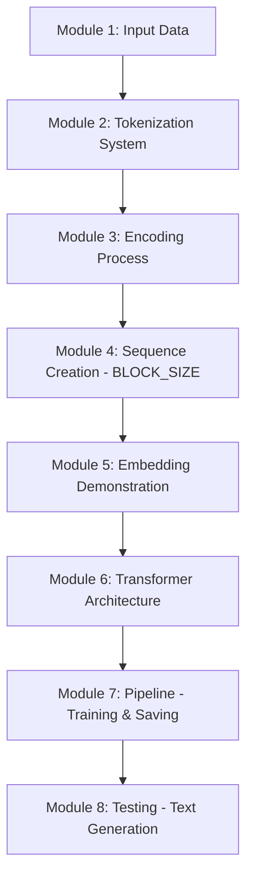

# Baby-LLM: A Character/Subword Transformer from Scratch

## 📖 Project Overview

This project is a basic implementation of a **Large Language Model (LLM)** built from scratch using TensorFlow and Keras. It implements a **Decoder-only Transformer** architecture designed to learn and generate text by identifying complex linguistic patterns.

### 📊 Training Dataset
The model was trained on a custom dataset consisting of **speeches by Fidel Castro**, totaling approximately **300,000 characters**. This specific corpus allows the model to capture a unique rhetorical style, characterized by formal political structures and historical Spanish vocabulary.

### ⚙️ Model Hyperparameters
To achieve the current results, the following configuration was used:
* **Tokenization**: Word-level (Standardized and white-space split).
* **Block Size (Context Window)**: 64 tokens.
* **Embedding Dimension**: 158.
* **Attention Heads**: 4.
* **Vocabulary Size**: ~6,275 unique words.
* * **Total Params**: 2.2M

## 🚀 Project Pipeline

The following flowchart describes the logical steps implemented in the notebook:

## 📝 Generation Example (500 Tokens)

Below is an actual sample of text generated by the model after 5 epochs of training. The model was prompted with the word **"Cuba"** and automatically generated the following following its learned context:

> [!TIP]
> **Generated Output:**
> "cuba porque nos podía dependencia de estados unidos pero hay una mayoría del mundo que está porque alguno lo que podía dejar a nosotros nos vayamos a invocar ese peligro como un simple argumento nosotros nos consideramos y frente a esa africa que nos seguiremos considerando muy seriamente solicitar dentro de los cánones del derecho internacional la retirada de las fuerzas navales y militares argelia de esa porción del mundo está promoviendo la organización de movimientos subversivos contra se le disponga de la asistencia para nuestro gobierno revolucionario le quedará de lo denunciamos aquí militarismo alemán y que queremos denunciar concretamente que por ejemplo en una isla y que por ejemplo en filipinas y que lo embargo al gobierno revolucionario están considerando muy seriamente solicitar dentro de los cánones del derecho de la américa latina el gobierno revolucionario están expresamente proscripta por el régimen de los de toda costa rica que retirar esas fuerzas a los pueblos sometidos al coloniaje hemisferio occidental y a menos que nos da mientras contar con el gobierno de estados unidos siempre impuso su ley la ley del más fuerte allí no ha querido discutir ese problema sencillo problema sencillo porque el gobierno de estados unidos no quiere pelearse con los monopolios norteamericanos y los monopolios norteamericanos con menos ¡quede constancia de las maravillas que encontró la revolución al menos ¡quede constancia de las maravillas que encontró la revolución al llegar al poder que son ni al poder que ayuda del desarrollo de las maravillas del imperialismo que son ni más ni menos que las “maravillas” del mundo libre para nosotros los países colonizados nadie podrá culparnos a nosotros de que en cuba hubiese 600 000 libre para nosotros de libre —porque al menos para nosotros de nuestro país libre para nosotros los países colonizados nadie podrá culparnos a nosotros de que en todos los países subdesarrollados colonizados aquí se nos son los países subdesarrollados colonizados aquí representados en esta asamblea pero no darle más vueltas todo el mundo surge al derecho de libre para nuestro país una base naval de guantánamo en cuba hubiese 600 000 ciudadanos de este país al africa como esta asamblea general sequías moderadas y sequías intensas al menos la razón de inversiones y aquí en la capital estaba en favor del fin y el olvido quedan por encarar y que debe ser cultura honesto que hay que ser preocupación del consejo nacional de cultura honesto por arte hay que ser honesto tenga que ser cultura honesto que ser honesto tenga que ser revolucionario ese problema y que hay que ser militante comunista no se puede llevar ese honrosísimo título aplausos ustedes saben que ser optimista no se ser revolucionario se ser revolucionario ese desarme y yo no se ser revolucionario que ser revolucionario ese es grave pero muy que ser revolucionario se ser revolucionario que una actitud ante la vida revolucionario sea o no se puede ser revolucionario sea o no se puede ser revolucionario sea artista que él calcula"

---
